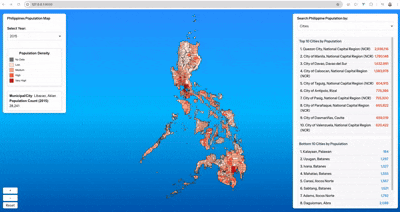

# Philippines Population Map Visualization

An interactive data visualization project for Philippine population density, built with **Vue 3**, **D3.js**, and **TopoJSON**. This project allows users to visualize population shifts across years (e.g., 2015 vs 2020) and search for demographic insights by City, Province, and Region.

## 🚀 Tech Stack

- **Backend Framework:** [Laravel 12](https://laravel.com/) (PHP)
- **Frontend Framework:** [Vue.js 3](https://vuejs.org/) with [Inertia.js](https://inertiajs.com/)
- **Visualization:** [D3.js](https://d3js.org/) & [TopoJSON](https://github.com/topojson/topojson)
- **Languages:** PHP, TypeScript / JavaScript
- **Linting & Formatting:** 
  - [ESLint](https://eslint.org/) (Flat Config)
  - [@vue/eslint-config-typescript](https://github.com/vuejs/eslint-config-typescript)
  - [Prettier](https://prettier.io/) (via `eslint-config-prettier`)

## 🛠️ Prerequisites

Ensure you have the following installed:
- **PHP** (>= 8.2)
- **Composer**
- **Node.js** (LTS version recommended) & **npm**

### Windows `php.ini` Configuration

Windows PHP installations require a few manual tweaks. Run `php --ini` to locate your `php.ini` file, then make the following changes:

1. **Enable the SQLite driver** — required if using the default SQLite database:
   ```ini
   ;extension=pdo_sqlite    ← remove the semicolon:
   extension=pdo_sqlite
   ```

2. **Fix SSL certificate errors** — required for fetching TopoJSON maps from GitHub:
   - Download the CA bundle: https://curl.se/ca/cacert.pem
   - Save it to your PHP directory (e.g., `C:\php\cacert.pem`)
   - Update these two lines in `php.ini`:
   ```ini
   curl.cainfo = "C:\php\cacert.pem"
   openssl.cafile = "C:\php\cacert.pem"
   ```
   *(Replace the path with the actual location where you saved `cacert.pem`)*

## 📦 Installation & Setup

1. **Clone the repository:**
   ```bash
   git clone <repository-url>
   cd ph-map-population
   ```

2. **Install dependencies:**
   ```bash
   composer install
   npm install
   ```

3. **Configure environment:**
   Copy the example environment file and generate the application key:
   ```bash
   cp .env.example .env
   php artisan key:generate
   ```

4. **Initialize database (Optional):**
   By default, the `.env` configuration uses SQLite to store cached map data, sessions, and queue jobs:
   ```env
   DB_CONNECTION=sqlite
   CACHE_STORE=database
   SESSION_DRIVER=database
   QUEUE_CONNECTION=database
   ```

   To initialize the database, create the SQLite file and run migrations:
   ```bash
   touch database/database.sqlite          # Linux/macOS
   # On Windows PowerShell, use:
   # New-Item -ItemType File -Path "database/database.sqlite" -Force
   php artisan migrate
   ```

   *Alternatively, if you want to run completely **database-free**, edit your `.env` to use file/sync drivers:*
   ```env
   CACHE_STORE=file
   SESSION_DRIVER=file
   QUEUE_CONNECTION=sync
   ```

5. **Build frontend assets:**
   ```bash
   npm run build
   ```

## 🐳 Docker Setup

This project includes a multi-stage `Dockerfile` and `docker-compose.yml` for easy containerized deployment. This setup automatically builds the Vue/Vite assets and serves the app using Nginx and PHP-FPM.

1. **Clone the repository:**
   ```bash
   git clone https://github.com/kevin0117/ph-map-population.git
   cd ph-map-population
   ```

2. **Configure environment:**
   ```bash
   cp .env.example .env
   ```

3. **Build and start the containers:**
   ```bash
   docker-compose up -d --build
   ```

4. **Access the application:**
   Open your browser and navigate to [http://localhost:8080](http://localhost:8080).

*(Note: The Docker configuration automatically installs dependencies, configures SQLite with migrations, and builds frontend assets.)*

## 💻 Development

### Run the development servers
To run this application locally, you need to start multiple services simultaneously. Instead of opening separate terminal tabs, you can start everything at once:
```bash
composer dev
```

This command uses `concurrently` under the hood to run all required development services inside a single terminal window:
- **`php artisan serve`**: Serves the PHP backend application locally (defaults to http://127.0.0.1:8000).
- **`npm run dev`**: Compiles and hot-reloads the Vue 3 and D3 frontend assets in real-time as you make changes.
- **`php artisan queue:listen`**: Listens for background tasks (useful for auth flows or deferred jobs).
- **`php artisan pail`** *(Linux/macOS only)*: Streams warnings and errors from the application code directly to your terminal in real-time.

> **Note:** On Windows, `pail` is automatically skipped because it requires the `pcntl` extension (Unix-only). You can check application logs in `storage/logs/laravel.log` instead.

*Closing the terminal or pressing `Ctrl+C` will automatically stop all processes together.*

### Lint and Fix files
The project uses the new ESLint Flat Config.
```bash
npm run lint
```

## Preview



## Accessing the Application

Once the development servers are running, access the application at:
[http://127.0.0.1:8000](http://127.0.0.1:8000)

*Note: On your first load, it will fetch geographic TopoJSON maps from GitHub and cache them locally in the database. Give it a few seconds to finish rendering.*


## 🗺️ Project Structure & Mapping Logic

The core visualization logic resides in [`resources/js/pages/Components/PhMap.vue`](resources/js/pages/Components/PhMap.vue).

- **Data Binding:** The component accepts `countryTopoJson`, `provincesTopoJson`, and `populations` as props.
- **Projection:** Uses `d3.geoMercator()` centered on coordinates `[122.42715, 12.499176]` to accurately render the Philippine archipelago.
- **Dynamic Scaling:** Population density is visualized using a `d3.scaleThreshold()` with a Red color scheme (`d3.schemeReds`).
- **Features:**
    - **Zoom/Pan:** Powered by `d3.zoom()` with custom scale extents.
    - **Search:** Categorized by Cities, Provinces, and Regions.
    - **Interactive Tooltips:** Real-time population count and growth indicators (↗/↘).

## 🔧 Configuration Notes

- **ESLint:** Configured to work with Vue + TypeScript. If you are using VS Code, ensure the ESLint extension is updated to support Flat Config (`eslint.config.js`).
- **Prettier:** Integrated into the linting workflow to turn off conflicting stylistic rules.

## 📄 License

MIT